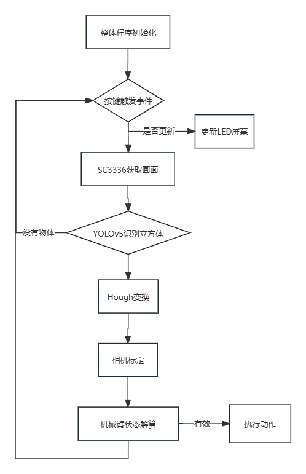

# VisualRoboticArmControl
基于视觉的机械臂控制系统（毕业设计）[演示视频](./DemoData/Demo.mp4)

基于[luckfox_pico_rtsp_yolov5](https://github.com/luckfox-eng29/luckfox_pico_rtsp_yolov5)项目上实现

## 主要程序流程图

## 主要实现功能：
1. Yolov5目标检测
2. Hough变换
3. 相机标定
4. 机械臂控制
